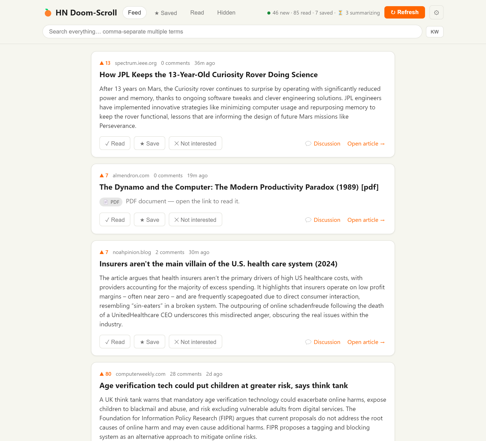
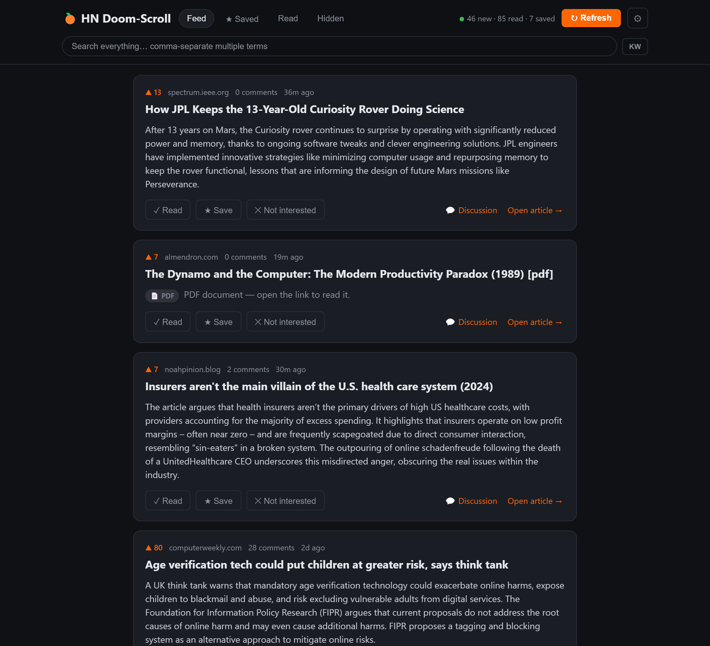
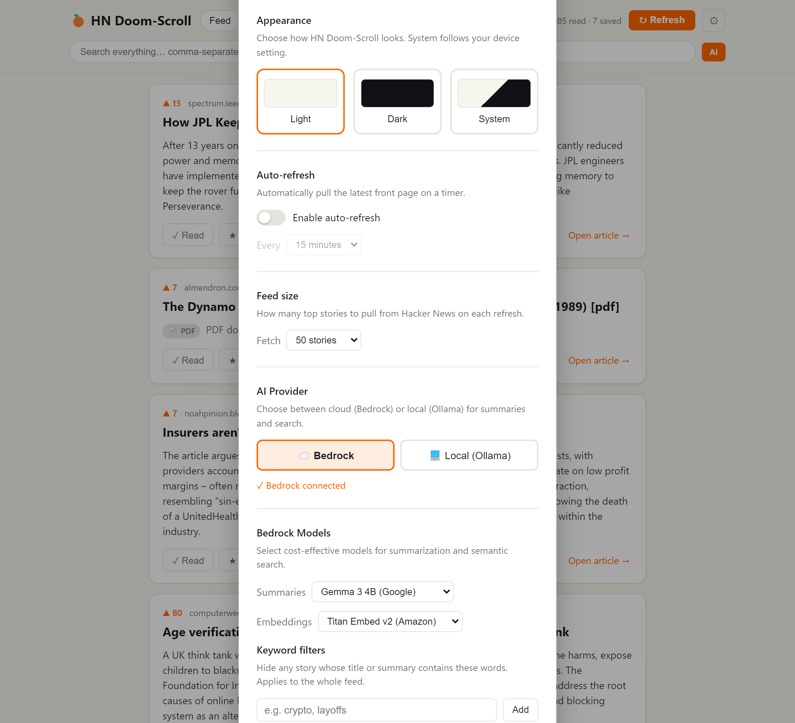
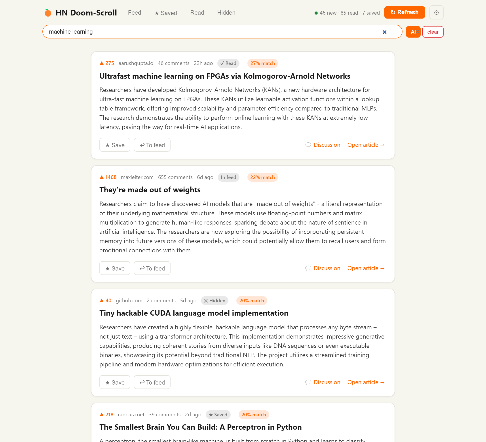

# 🍊 HN Doom-Scroll

A personal Hacker News reader that turns the front page into a doom-scroll feed
with AI-generated article summaries. Mark stories as **read**, **save** them for
later, or flag them **not interested** — and they leave the feed. Search
everything you've seen by keyword or meaning.

SQLite for storage. Summaries and embeddings via AWS Bedrock (default) or local
Ollama models. No accounts, no tracking, no ads.

## Screenshots

| Light | Dark |
|-------|------|
|  |  |

Settings — provider toggle, model selection, themes, and filters:


AI Provider settings — switch between Bedrock and Ollama with model dropdowns:



Semantic search ranks results by meaning, with a match score on each:



> Regenerate screenshots: `python scripts/capture_screenshots.py` and
> `python scripts/capture_extra.py` (requires a running instance and Playwright).

## Stack

| Layer | Tech |
|-------|------|
| Backend | Python + FastAPI |
| Storage | SQLite (`hn.db`, auto-created) |
| Summaries | AWS Bedrock (`google.gemma-3-4b-it`, default) or local Ollama (`llama3.2:3b`) |
| Embeddings | AWS Bedrock (`amazon.titan-embed-text-v2:0`, default) or local Ollama (`nomic-embed-text`) |
| Article extraction | `trafilatura` + Playwright headless Chromium fallback |
| Frontend | Vanilla HTML/CSS/JS, infinite scroll, no build step |

## Quick start

### Option A — AWS Bedrock (default, fast)

1. Configure AWS credentials with Bedrock access (`aws configure` or env vars).
2. Double-click **`run.bat`** (or run from a terminal).
3. Browser opens to http://localhost:8000.

No model downloads required. Both summaries and semantic search work immediately
via Bedrock (Gemma 3 4B for summaries, Titan Embed v2 for search).

### Option B — Local Ollama (fully offline)

1. Install and start [Ollama](https://ollama.com).
2. Pull models:
   ```
   ollama pull llama3.2:3b
   ollama pull nomic-embed-text   # optional — enables semantic search
   ```
3. Set the env var before launching:
   ```
   set HN_PROVIDER=ollama
   run.bat
   ```

Summaries are slower (CPU-bound) but everything stays on your machine.

### First run

`run.bat` creates the virtualenv, installs dependencies (including `boto3` for
Bedrock), and downloads Playwright Chromium (~150 MB, one-time). Playwright is
optional — skip it and the app falls back to direct fetch + HN discussion
summaries for JS-heavy pages.

## How it works

- Fetches HN top stories on startup and stores them in SQLite.
- **On-demand summaries.** As each card scrolls near the viewport, the app calls
  the configured provider to summarize that article. The header bar shows a
  running count of pending summaries. Cards display "⏳ Summarizing…" until
  their summary arrives, then update in place.
- **Article extraction is layered.** For each story: (1) direct fetch with
  browser headers, (2) headless Chromium render for JS-heavy pages, (3) fallback
  that summarizes the HN discussion. Badges show the source — 💬 From HN
  discussion, 🌐 Rendered page — or why it couldn't be read — 🔒 Paywalled,
  📄 PDF, 🎥 Video.
- **Crash recovery.** If the server is killed mid-summarization, stuck pending
  stories are automatically reset on the next startup.
- **✓ Read / ★ Save / ✕ Not interested** — each moves a story out of the feed.
  Stories never reappear once acted on.
- **Learns from what you skip.** After 10+ hidden stories, recurring patterns
  (words, domains) down-rank similar new stories to the bottom of the feed,
  dimmed with a reason. Nothing is hidden outright.
- **Bulk-hide dimmed stories.** A "Hide all dimmed stories" banner appears
  between your normal stories and the down-ranked ones. One click hides them
  all at once.
- **Search** across everything (feed, read, saved, hidden) by keyword or
  semantic meaning. Toggle kw/ai in the search box. Semantic search uses the
  configured provider's embedding model (Titan Embed v2 on Bedrock,
  `nomic-embed-text` on Ollama). Query embeddings are cached for 10 seconds
  to avoid redundant API calls during typing. Embedding backfill runs in the
  background after summaries complete, keeping search responsive.
- **Auto-refresh** pulls the latest front page on a timer. The refresh button
  doubles as a countdown.

## Settings

Click **⚙** in the header. Everything persists between sessions.

- **AI Provider:** toggle between ☁️ Bedrock (cloud) and 💻 Ollama (local).
  Switching takes effect immediately for new summaries and searches.
- **Bedrock Models:** (shown when Bedrock is active) select from curated
  cost-effective models for summarization (Claude 3 Haiku, Gemma 3 4B, Llama 3
  8B, Nova Micro) and embeddings (Titan Embed v2, Cohere Embed v3/v4).
- **Ollama Models:** (shown when Ollama is active) pick from models installed
  locally. Pull more with `ollama pull <name>`.
- **Themes:** Light, Dark, or System (follows OS preference).
- **Auto-refresh:** 5–60 min interval, countdown in the refresh button.
- **Feed size:** 25–200 top stories per refresh.
- **Keyword filters:** hide stories containing specific words.
- **Re-embed all:** regenerate all stored embeddings after switching models.

## Provider configuration

| Env var | Values | Default |
|---------|--------|---------|
| `HN_PROVIDER` | `bedrock` or `ollama` | `bedrock` |
| `BEDROCK_REGION` | AWS region | `us-east-1` |
| `BEDROCK_REASON_MODEL` | Bedrock model ID for summaries | `google.gemma-3-4b-it` |
| `BEDROCK_EMBED_MODEL` | Bedrock model ID for embeddings | `amazon.titan-embed-text-v2:0` |

In Ollama mode, models are selected in-app via Settings → Models.

## Files

| File | Purpose |
|------|---------|
| `app.py` | FastAPI app, routes, on-demand summary + embedding generation |
| `hn.py` | Hacker News API client |
| `summarizer.py` | Article extraction, summarization, and embeddings (Bedrock + Ollama) |
| `db.py` | SQLite schema, queries, search, dislike-learning |
| `static/` | Frontend (`index.html`, `style.css`, `app.js`) |
| `scripts/capture_screenshots.py` | Screenshot generator for README |
| `scripts/capture_extra.py` | Additional screenshots (semantic search, provider settings) |
| `docs/` | README screenshots |
| `run.bat` | One-click launcher |
| `push-to-github.bat` | Publishes to standalone GitHub repo |
| `requirements.txt` | Python dependencies |
| `CHANGELOG.md` | Version history |
| `LICENSE` | MIT |

## Notes

- The status indicator in the header shows green when the provider is reachable,
  red when it isn't.
- Bedrock mode runs summaries concurrently (fast). Ollama mode serializes them
  (one at a time, to avoid overloading the local model).
- In Ollama mode, semantic search requires the `nomic-embed-text` model. If it
  isn't installed, search falls back to keyword automatically.
- Ask HN / Show HN text posts are summarized from the post + discussion directly.
